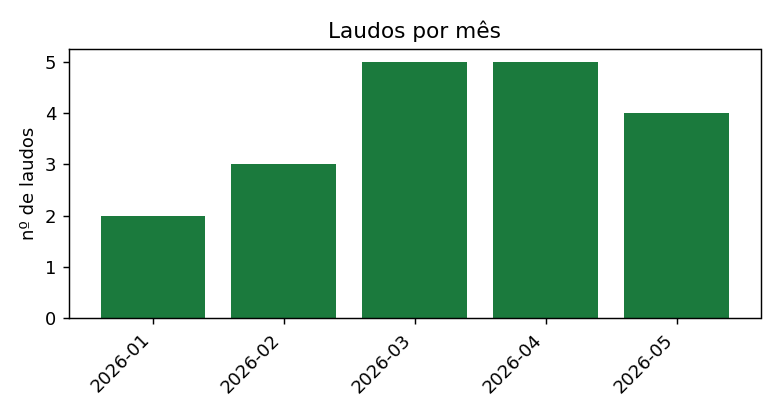
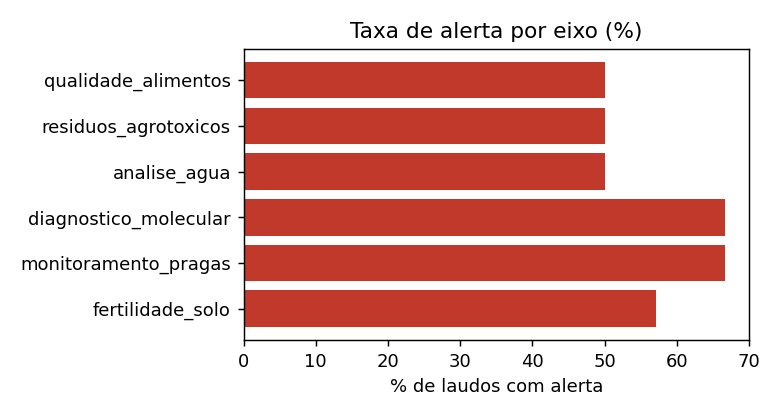
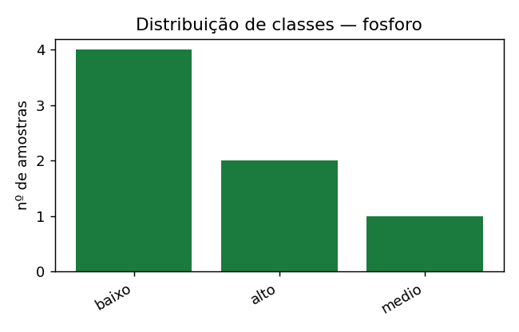
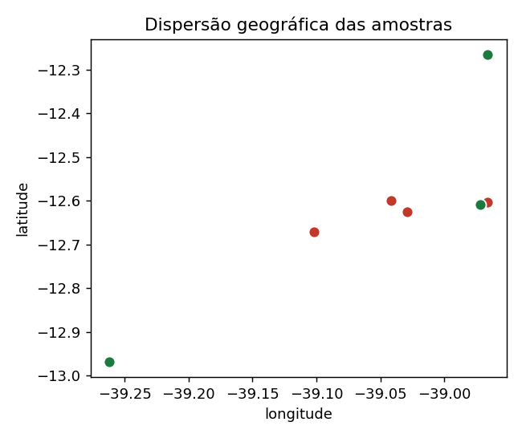

# Relatório automático — CETAB / SIPA-Bahia AI

> Rascunho gerado pelo Núcleo Científico a partir do Data Lake.
> Revisar e validar antes de qualquer publicação. Números provêm dos dados; texto é sugestão.

## Descrição dos dados
- **Registros (resultados):** 58
- **Laudos:** 19
- **Eixos de análise:** analise_agua, diagnostico_molecular, fertilidade_solo, monitoramento_pragas, qualidade_alimentos, residuos_agrotoxicos
- **Período de coleta:** 2026-01-12 a 2026-05-20

## Material e Métodos (rascunho)
As amostras foram analisadas nos laboratórios do CETAB e os resultados normalizados por
extração assistida por IA para um esquema canônico, com classificação automática contra
faixas de referência e revisão humana dos casos de baixa confiança. Os dados foram
consolidados em um Data Lake georreferenciado, do qual este conjunto foi extraído com
proveniência registrada.

## Estatística descritiva
| Eixo | Parâmetro | n | média | mín | máx |
|---|---|---|---|---|---|
| analise_agua | coliformes_termotolerantes | 2 | 1.5 | 0.0 | 3.0 |
| analise_agua | ph | 2 | 7.0 | 6.8 | 7.2 |
| analise_agua | turbidez | 2 | 5.75 | 3.0 | 8.5 |
| fertilidade_solo | fosforo | 7 | 14.71 | 5.0 | 35.0 |
| fertilidade_solo | materia_organica | 7 | 1.9 | 1.0 | 3.2 |
| fertilidade_solo | ph | 7 | 5.41 | 4.8 | 6.4 |
| fertilidade_solo | potassio | 7 | 54.86 | 26.0 | 110.0 |
| qualidade_alimentos | acidez | 2 | 45.0 | 35.0 | 55.0 |
| qualidade_alimentos | hmf | 2 | 47.5 | 25.0 | 70.0 |
| qualidade_alimentos | umidade | 2 | 19.75 | 18.5 | 21.0 |
| residuos_agrotoxicos | carbendazim | 2 | 0.04 | 0.04 | 0.05 |
| residuos_agrotoxicos | clorpirifos | 2 | 0.02 | 0.005 | 0.03 |
| residuos_agrotoxicos | imidacloprido | 2 | 0.15 | 0.1 | 0.2 |

## Figuras

